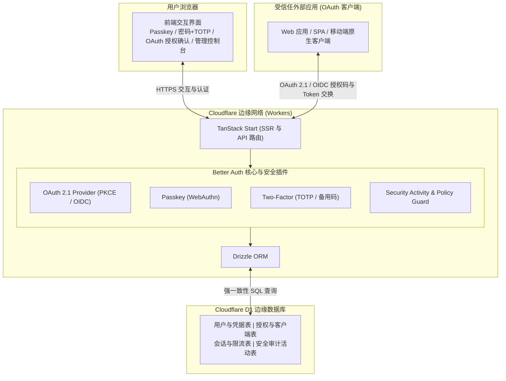
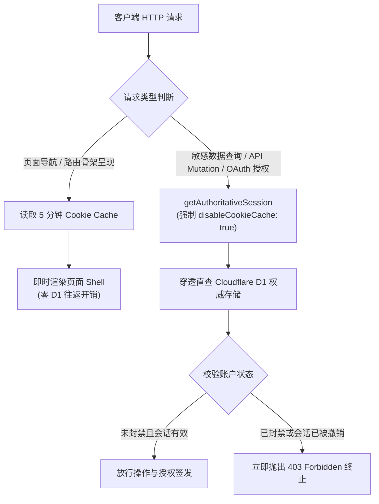
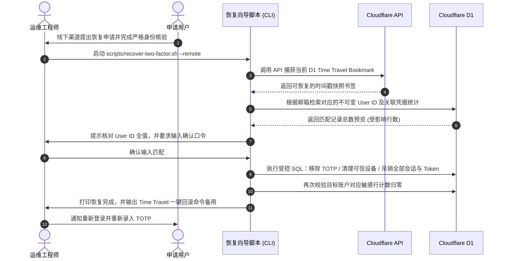

如果你想给自己的多个独立项目搭建一套统一登录系统，现有的开源方案大多会逼你买一台常驻虚拟机跑 Java 或 Postgres，而商业 SaaS 则会在你需要跨应用签发 OAuth Token 时把你推进每月几百刀的企业套餐。

我们花了两个月把授权服务器完整搬上了 Cloudflare Workers 和 D1。没有常驻容器，没有 Redis，完全跑在 Cloudflare 边缘网络上，每月服务器账单为 0。

但把一个包含密码学签名、WebAuthn 握手和严格会话控制的系统搬进无状态边缘运行时，踩坑的数量远超预期。这篇文章记录 [Easy Auth](https://github.com/Jazee6/easy-auth)（在线演示：[account.jaze.top](https://account.jaze.top)）的架构设计，以及我们在安全和边缘性能之间做出的具体权衡。

## 为什么框架自带的 Auth 满足不了需求

很多前端开发者第一反应是用 NextAuth (Auth.js) 或者类似的框架库。

但这里有一个本质概念的区别：应用内会话管理库并不等于授权服务器（Authorization Server）。

如果你只有一个网站，在里面用 Session Cookie 记录用户登录态就足够了。

当你拥有三个以上独立域名、移动端应用或桌面客户端时，这套模式会迅速崩塌。你不可能把用户密码和数据库连接串分发到每个小项目中。你需要的是一个独立的身份信任域：核心系统负责用户管理、TOTP 校验和 Passkey 凭据，外部应用只作为受信任的 OAuth 客户端，通过标准 OAuth 2.1 授权码流程和 PKCE 换取 Access Token 和 ID Token。

现有的自建方案（Keycloak、Zitadel、Ory Hydra）功能扎实，但它们的设计假设是常驻服务器环境。冷启动慢、内存占用高，一个月哪怕只有两百次登录，你依然得为常驻的 CPU 和内存买单。

我们想试试看能不能在 Serverless 边缘网络上把这件事做成。

## 整体架构与边缘拓扑

Easy Auth 运行在 Cloudflare Workers 上，底层唯一的持久化数据库是 Cloudflare D1（分布式 SQLite）。

前端与服务端由 TanStack Start 统一驱动。我们放弃了将 Next.js 包装到 Workers 上的做法，因为 TanStack Start 直接面向原生 Web Request/Response 标准，没有臃肿的 Node.js 兼容层垫片，边缘冷启动耗时可以稳定控制在 35ms 到 45ms 之间。



为了保证边缘冷启动速度，数据库 Schema 迁移绝不能在 Worker 启动时动态执行。

我们在本地通过 `drizzle-kit` 生成具体的 SQL 变更文件，由 CI 或本地 Wrangler 提前将 migration 写入 D1，Worker 运行时只做纯粹的只读和业务写入：

```bash
bun run auth:generate
bun run db:generate
bun run db:migrate:local
```

认证核心由 Better Auth 驱动。我们在工厂函数中组合了核心能力和受控插件：

```typescript
// src/lib/auth-factory.ts
import { betterAuth } from "better-auth";
import { drizzleAdapter } from "better-auth/adapters/drizzle";
import { admin, jwt, twoFactor } from "better-auth/plugins";
import { oauthProvider } from "@better-auth/oauth-provider";
import { passkey } from "@better-auth/passkey";
import { drizzle } from "drizzle-orm/d1";
import * as schema from "../db/schema";
import { derivePasskeyRpConfig } from "./passkey-policy";
import { hasAdministratorRole } from "./oauth-policy";

export function createEasyAuth({ environment }: EasyAuthFactoryOptions) {
  const database = drizzle(environment.DB, { schema });
  const rpConfig = derivePasskeyRpConfig(environment.BETTER_AUTH_URL);

  return betterAuth({
    appName: "Easy Auth",
    baseURL: environment.BETTER_AUTH_URL,
    secret: environment.BETTER_AUTH_SECRET,
    database: drizzleAdapter(database, {
      provider: "sqlite",
      schema,
    }),
    session: {
      cookieCache: {
        enabled: true,
        maxAge: 5 * 60,
        strategy: "compact",
      },
    },
    plugins: [
      admin({ defaultRole: "user", adminRoles: ["admin"] }),
      jwt(),
      twoFactor({
        issuer: "Easy Auth",
        allowPasswordless: false,
        backupCodeOptions: { storeBackupCodes: "encrypted" },
      }),
      oauthProvider({
        loginPage: "/login",
        consentPage: "/consent",
        scopes: ["openid", "profile", "email", "offline_access"],
        grantTypes: ["authorization_code", "refresh_token"],
        allowDynamicClientRegistration: false,
        clientRegistrationRequirePKCE: true,
        refreshTokenReuseInterval: 0,
        storeClientSecret: "hashed",
        prefix: {
          clientSecret: "ea_cs_",
          opaqueAccessToken: "ea_at_",
          refreshToken: "ea_rt_",
        },
        clientPrivileges: ({ user }) => hasAdministratorRole(user?.role),
      }),
      passkey({
        rpID: rpConfig.rpID,
        origin: rpConfig.origin,
        rpName: rpConfig.rpName,
        authenticatorSelection: { userVerification: "required" },
      }),
    ],
  });
}
```

默认的插件组合虽然能跑通基础流程，但在公网面对真实请求时，很多默认行为并不符合严格的安全边界。

以下是我们在实际落地过程中做出的关键架构权衡。

## 为什么隐式邮箱合并会变成账户接管后门

很多认证库有一个默认特性：如果用户使用 GitHub 登录，且 GitHub 返回的已验证邮箱与数据库里现有的某个账户相同，系统会自动把 GitHub 账号关联到该已有账户并完成登录。

这个特性表面上提升了便利性。

但它是一个巨大的安全隐患。

不同第三方身份提供方的邮箱验证标准并不一致。有的提供方允许修改主邮箱且缺乏二次确认，有的提供方在历史遗留系统中存在逻辑缺陷。如果系统仅凭外部传来的同名邮箱就自动合并，攻击者可以通过外部服务注册相同邮箱，静默接管系统内的合法账户。

我们在架构决策（ADR-0001）中彻底禁用了隐式关联：

```typescript
// src/lib/auth-factory.ts
account: {
  encryptOAuthTokens: true,
  accountLinking: {
    disableImplicitLinking: true, // 彻底关闭根据同名邮箱自动合并
    allowDifferentEmails: true,   // 允许登录后手动绑定不同邮箱的社交账号
    updateUserInfoOnLink: false,
    allowUnlinkingAll: false,     // 账户必须保留至少一种可用登录方式
  },
},
```

现在的规则十分清晰：
1. 如果用户用一个全新的第三方邮箱登录，且系统内没有任何账户使用该邮箱，允许通过开放注册直接创建新账户。
2. 如果该邮箱在系统内已被占用，但此前从未绑定过这个第三方身份，系统直接报错并拦截登录，要求用户使用已有凭据（密码或 Passkey）先登入系统。
3. 用户必须在已登录的安全会话内，主动前往账户面板点击“绑定身份”。

在 1.0.1 版本中，我们更进一步支持了跨邮箱绑定。

很多开发者的 GitHub 主邮箱是私人邮箱，但在特定系统里使用的是工作邮箱。只要你在当前已认证的 Session 内发起绑定操作，即使两个邮箱不同，系统也允许显式绑定。因为发起方已经通过了安全证明，不再存在越权风险。

## 用 5 分钟 Cookie Cache 换 SSR 速度，但敏感鉴权必须穿透到 D1

在边缘无服务器架构下，每一次 D1 数据库查询都会增加请求延迟。

Better Auth 提供了一个优化方案：5 分钟 Cookie Cache。系统把用户的 Session 关键字段以签名加密的形式放在客户端 Cookie 里。在 5 分钟之内，服务端的路由和组件可以直接读取 Cookie 解析用户信息，不需要查询 D1。

这对页面渲染和路由跳转非常有用，页面切换几乎感受不到任何延迟。

但这也埋下了一枚定时炸弹。

如果一个违规账户正在进行恶意操作，管理员在后台点击了“封禁账户”或者“强制踢出所有会话”，按照 Cookie Cache 的逻辑，被封禁的用户在接下来的 300 秒内依然被认定为有效会话，可以继续调用 API。

对于一个身份授权服务器来说，让一个被撤销权限的账户继续横行 5 分钟是不可接受的。

我们采取的方案是双层会话策略（ADR-0005）：



在所有涉及真实权限检查的代码中，我们使用 `getAuthoritativeSession` 替代常规读取：

```typescript
// src/lib/authoritative-session.ts
import type { createEasyAuth } from "./auth-factory";

type SessionAuthApi = Pick<ReturnType<typeof createEasyAuth>["api"], "getSession">;

export function getAuthoritativeSession(authApi: SessionAuthApi, headers: Headers) {
  // 必须显式传入 disableCookieCache: true，穿透缓存直达 D1 数据库
  return authApi.getSession({
    headers,
    query: { disableCookieCache: true },
  });
}
```

现在界限分明了：页面骨架可以看缓存，但只要你试图点击“确认授权给新应用”或者“修改安全设置”，系统立刻去 D1 检查你是否被 Ban。

被封禁的账户可能还能看一眼静态面板，但绝对无法发出任何带有副作用的操作。

## 绝不信任 Host 头：Passkey 的 RP ID 为何必须静态死绑

Passkey (WebAuthn) 对域名有严格的密码学约束。每次在浏览器内弹窗签名时，硬件安全芯片都会强校验系统的 Relying Party ID (RP ID) 和 Origin。

网上很多开源项目的示例代码喜欢这么写：

```typescript
// 极其危险的反模式：动态从请求头推导 RP ID
const host = request.headers.get("host");
const rpID = host ? host.split(":")[0] : "localhost";
```

这在反向代理、CDN 多回源、或者预览环境下会产生灾难性的安全漏洞。如果攻击者通过伪造的 Host 头发起握手，或者在不同环境之间混淆域名，很可能造成凭据跨环境复用。

我们在架构中规定（ADR-0006）：RP ID 和 Origin 必须严格从服务端环境变量 `BETTER_AUTH_URL` 静态解析，绝不读取任何运行时的 HTTP 请求头：

```typescript
// src/lib/passkey-policy.ts
export function derivePasskeyRpConfig(betterAuthUrl?: string): PasskeyRpConfig {
  if (!betterAuthUrl) {
    return {
      rpID: "localhost",
      origin: "http://localhost:3000",
      rpName: "Easy Auth",
    };
  }

  const url = new URL(betterAuthUrl);
  if (url.protocol !== "http:" && url.protocol !== "https:") {
    throw new Error(`Invalid BETTER_AUTH_URL protocol: "${betterAuthUrl}"`);
  }

  return {
    rpID: url.hostname,
    origin: url.origin,
    rpName: "Easy Auth",
  };
}
```

这样做锁死了环境边界：本地开发是 `localhost`，预发环境是自己的域名，生产环境是 `account.jaze.top`。三者之间没有任何凭据欺骗的可能。

这个决定带来的已知代价：**如果未来 Easy Auth 迁移了根域名，旧域名下绑定的所有 Passkey 都会在客户端失效。**

用户必须通过备用方式（本地密码或 GitHub）登录后，在新域名下重新录入生物识别。我们在文档中如实写明了这个约束，因为为了防范凭据伪造，静态绑定的代价是值得付出的。

## 裁剪 Admin Plugin：除了封禁和踢会话，其他端点全部 Default-Deny

Better Auth 的 Admin 插件功能非常全面，自带了用户修改、密码重置、模拟登录（Impersonate）、权限分配等十几个端点。

但在一个多管理员的生产系统里，直接开放这套 API 等于给运维留了无数横向越权的后门。

比如，一个管理员可能通过调用 `/admin/set-role` 悄悄提权，或者使用 `/admin/impersonate-user` 冒充其他用户操作。

我们在中间件层执行了严格的 Default-Deny 策略（ADR-0004）：

```typescript
// src/lib/admin-policy.ts
const directAdminPluginPaths = new Set([
  "/admin/set-role",
  "/admin/get-user",
  "/admin/create-user",
  "/admin/update-user",
  "/admin/list-users",
  "/admin/list-user-sessions",
  "/admin/unban-user",
  "/admin/ban-user",
  "/admin/impersonate-user",
  "/admin/stop-impersonating",
  "/admin/revoke-user-session",
  "/admin/revoke-user-sessions",
  "/admin/remove-user",
  "/admin/set-user-password",
  "/admin/has-permission",
]);

// 生产环境只对管理员开放四种关键处置操作
export function isAllowedDirectAdminPluginPath(path: string | undefined): boolean {
  return (
    path === "/admin/ban-user" ||
    path === "/admin/unban-user" ||
    path === "/admin/revoke-user-session" ||
    path === "/admin/revoke-user-sessions"
  );
}
```

所有未经许可的 Admin 插件端点在请求刚刚命中中间件时就会被抛出 403 Forbidden 并终止。

同时，我们把系统内的账户分为普通账户和管理员账户。管理员可以在后台封禁普通账户、踢除其设备；但如果目标账户本身也是管理员，接口会直接拒绝执行。管理员账户的处置必须由拥有 D1 数据库底层操作权限的运维人员手动完成。

所有面向管理界面的用户列表查询，都使用我们自己手写的 Drizzle 投影（Projections），用户的会话 Token 和敏感哈希永远不会被序列化传递到前端。

## 丢了 2FA 怎么办？为什么我们用 D1 Time Travel 脚本替代邮件重置

不少产品的 2FA 设计存在一个讽刺的漏洞：

系统提示你开启了 TOTP 双重验证，并生成了备用码。但当你在登录页点击“丢失了验证器”，系统会非常“贴心”地弹出一个按钮：“向您的注册邮箱发送 2FA 重置链接”。

这从根基上击穿了双重验证的意义。

只要你的第二因子可以通过第一因子（邮箱）来单方面重置，那么你的第二因子在安全模型上根本不存在。黑客只要拿到了你的邮箱权限，你的 TOTP 就会被一键解除。

Easy Auth 坚决不在前端提供任何自助式重置 2FA 的通路。

如果一个账户丢失了手机上的 Authenticator 应用，同时又弄丢了全部备用码，唯一的解决途径是走**离线运维恢复流程（Offline Operations-Only Recovery）**。

我们专门编写了一个交互式终端向导脚本 `scripts/recover-two-factor.sh`：

```bash
# 执行生产环境 2FA 离线恢复
scripts/recover-two-factor.sh --remote
```

这个向导必须由具备真实运维权限的工程师在线下人工核实用户身份后运行：



这里深度结合了 Cloudflare D1 的 **Time Travel** 特性。在向导执行任何 SQL 变更前，脚本会先捕获当前数据库状态的快照书签（Bookmark）。一旦运维发现填错了邮箱或者用户身份有争议，可以使用生成的书签在几秒内精确还原数据库。

完成恢复后，该账户的所有有效 Session 和 OAuth Token 全部作废，迫使账户在下一次登录后必须立刻重新登记新的 TOTP 密钥。

## Worker 运行时的坑：为什么邮件派发不能直接 await

在处理注册验证码和密码重置邮件时，我们使用 Resend 的 HTTP API。

第一版开发时，我们在处理函数里直接 `await` 邮件发送接口。结果一个简单的注册请求耗时从 30ms 飙升到了 650ms，大部分时间都在等待跨国跨机房的 SMTP/HTTP 网络握手。

后来我想了个自以为聪明的办法：直接把 `await` 去掉，让它在后台慢慢发，先给前端返回 200。

```typescript
// 严重踩坑：在 Cloudflare Worker 中千万不要这么做
resend.emails.send({ ... }); // 没有 await，以为能在后台静默运行
return Response.json({ success: true });
```

本地用 Vite 开发时一切正常。

但一发到 Cloudflare Workers 生产环境，验证码邮件开始大面积丢失。排查后才发现：Cloudflare Workers 是基于 V8 Isolate 的事件循环模型。一旦当前请求的 Response 已经返回，且事件循环中没有被注册的活动，边缘节点会立即挂起或直接销毁当前的 Worker 实例。那个脱离了上下文的 Promise 会被直接掐断。

正确的写法是利用 Workers 专有的 `waitUntil` 机制：

```typescript
// src/lib/email-service.ts
export function scheduleBackgroundTask(
  task: Promise<unknown>,
  waitUntil: (task: Promise<unknown>) => void,
) {
  try {
    // 告知 Worker 运行时：这个任务虽然不在主响应链路里，但在它完成前不要冻结上下文
    waitUntil(task);
  } catch {
    void task.catch((error) => {
      console.error("Background task failed:", error);
    });
  }
}
```

通过 `waitUntil`，我们在 25ms 内把注册成功的响应返回给前端浏览器，而邮件的 HTTP 握手在后台安全完成，既保住了极致响应，又避免了邮件丢包。

## 外部客户端如何接入 Easy Auth

搭建好了授权服务器，外部受信任的应用如何接入？

Easy Auth 暴露了标准的 OIDC Discovery 端点：`/.well-known/openid-configuration`。

以我开源的另一个实时聊天应用 [Web Chat](https://github.com/Jazee6/web-chat) 为例，在客户端应用中，只需使用 Better Auth 的 `genericOAuth` 插件，就能在几行代码内完成标准 OIDC 接入：

```typescript
// 外部应用客户端配置示例 (如 Web Chat)
import { betterAuth } from "better-auth";
import { genericOAuth } from "better-auth/plugins";

export const auth = betterAuth({
  // ...
  plugins: [
    genericOAuth({
      config: [
        {
          providerId: "easy-auth",
          discoveryUrl: "https://account.jaze.top/api/auth/.well-known/openid-configuration",
          clientId: process.env.EASY_AUTH_CLIENT_ID,
          clientSecret: process.env.EASY_AUTH_CLIENT_SECRET,
          authentication: "basic",
          pkce: true, // 强制 PKCE 防御授权码拦截
          scopes: ["openid", "profile", "email"],
          overrideUserInfo: true,
        },
      ],
    }),
  ],
});
```

如果外部应用采用[无状态会话模式（Stateless Session）](https://www.better-auth.com/docs/concepts/session-management#stateless-session-management)，外部应用甚至无需自建数据库表来存储会话，直接在用户创建钩子中将系统的 User ID 固定为 Easy Auth 签发的 `sub`：

```typescript
// 无状态外部应用中统一用户 ID
export const authConfig: BetterAuthOptions = {
  databaseHooks: {
    user: {
      create: {
        before: (user) => {
          return {
            data: {
              ...user,
              id: user.sub, // 直接对齐 Easy Auth 的不可变身份 Subject
            },
          };
        },
      },
    },
  },
};
```

这样外部应用既享受了分布式 JWT / Cookie 的无状态轻量特性，又能在底层与全局身份域保持严格的数据一致。

## 已知局限与客观权衡

没有任何一套架构是银弹。Easy Auth 在保持极简和边缘适配的同时，做出了以下已知妥协：

1. **统一公共 Subject (ADR-0002)**：Easy Auth 目前向所有接入的 OAuth 客户端签发的 ID Token 中，`sub` 字段都直接等于内部的不可变 User ID。这方便了我们在自己的各个产品线之间打通用户数据，但也意味着不同的应用之间理论上可以通过 `sub` 关联同一个自然人（即不支持 Pairwise 伪匿名标识）。
2. **客户端归属单个管理员 (ADR-0003)**：每个注册的 OAuth 客户端绑定在创建它的管理员 User ID 上，目前没有引入复杂的企业级团队协作角色模型。如果某位管理员离职，需要运维直接去 D1 数据库执行一行 SQL 变更 `oauthClient.userId`。
3. **D1 的写入并发限制**：D1 底层是分布式 SQLite，读性能极强且边缘复制快速，但写操作依然遵循单写入者原则。在应对突发的大规模并发注册时，写入吞吐量不如分布式 Postgres。但对中小型独立项目而言，这个天花板目前还远远达不到。

## 结语

在完全不买云服务器、不搭建 Docker 容器的前提下，跑起一个生产级别的身份中心是完全可行的。

整个 Easy Auth 运行在 Cloudflare Workers 和 D1 上，配合 TanStack Start 和 Better Auth，提供了现代化的 OAuth 2.1 规范、PKCE 授权支持、Passkey 免密验证以及 TOTP 安全防护。

代码已经完全开源：[Jazee6/easy-auth](https://github.com/Jazee6/easy-auth)。

如果你也在寻找一套轻巧、不需要为闲置资源买单、且能完全掌控用户数据的统一身份基础设施，欢迎参考和交流。
